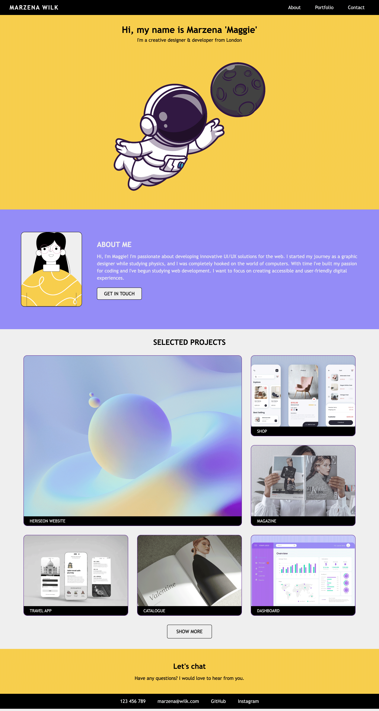

# Challenge2

## Description 

> In the Challege2 I was creating my first portfolio website.
> I needed to use grids and flexboxes and making it responsive.
> The challenge allowed to create a new layout if we keep key elelments from the example (banner, about secion, portfolio and contact)

## Usage 

* Deployed application - [https://marzena-w.github.io/portfolio-html/]
* Screenshot of the portfolio:

## Credits

* For more information about grid and flexbox
W3 - [https://www.w3schools.com/html/default.asp]

* To see website updates while making changes to the code
Live Server - [https://marketplace.visualstudio.com/items?itemName=ritwickdey.LiveServer]

## License

MIT
